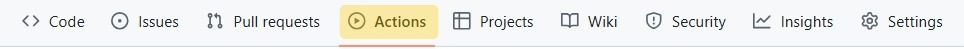
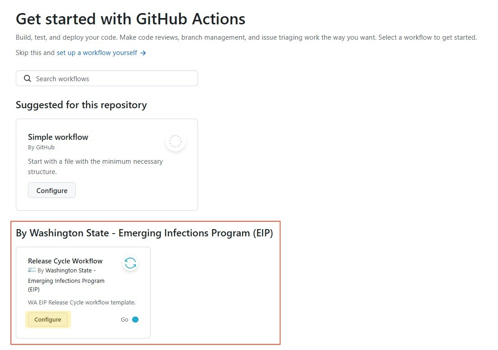
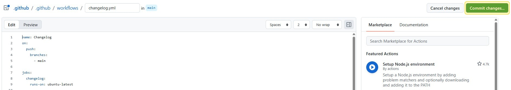
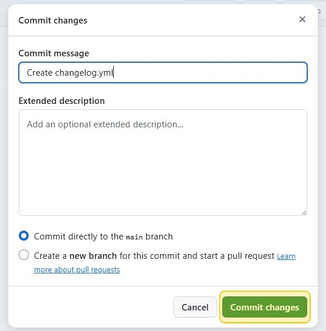

# ⚖️ Versioning Standards

This section will outline standards for documenting your repository to enhance collaboration, provide clarity and ease adaptation across teams. Please follow the [Release Cycle Process](#-release-cycle-process), [Branch Strategy](#-branch-strategy), and [Commit Guidelines](#-commit-guidelines) to organize and manage contents in your repo.


---

## 📋 Table of Contents
- [Release Cycle Process](#-release-cycle-process)
- [Branch Strategy](#-branch-strategy)
- [Commit Guidelines](#-commit-guidelines)
- [Step by Step Process](#️-step-by-step-process)
- [Version Numbering](#-version-numbering)
- [Important Notes](#-important-notes)

---

## 🔁 Release Cycle Process
This repository uses an automated release workflow that manages versioning and releases through GitHub Actions. The process follows a structured branching strategy and automated releases through pull requests. If you would like to read more information about release cycles, please [click here].

<details>
<summary>
<b>To initiate releases on the repo you created, follow the steps below. <br></b>
</summary> <br />

1. Once you have set up your repo with the standard files (`README`, `LICENSE`, etc.) and before you add your contributions (code, documents, etc.), click the Actions tab on the top banner. <br>


2. The Actions page will present several workflow options. Please navigate to the <b>Release Cycle Workflow</b> by Washington State - Emerging Infections Program (EIP). Click `Configure`.<br>


3. The YAML file will appear. Click `Commit Changes...` on the upper right hand corner. <br>


4. A pop of confirming your commit will appear. You may select the option, `Commit directly to the main branch`. Then click `Commit changes`.<br>


5. Your repo will now have Releases 👏
</details>
<br>

[click here]: https://nw-page.github.io/standards/gh/release.html


---

## 🌳 Branch Strategy
The table below lists naming conventions you may use for your branches based off your main branch. Utilizing a branch strategy can help identify what work is being done in the branch.

| Branch         | Purpose                                      |
|----------------|----------------------------------------------|
| `main`         | Production-ready code                        |
| `release/*`    | Release preparation (e.g., `release/0.1.0`)  |
| `feature/*`    | New feature development                      |
| `fix/*`        | Bug fixes                                    |
| `docs/*`       | Documentation changes                        |
| `refactor/*`   | Code refactoring                             |
| `chore/*`      | Maintenance tasks                            |


---

## 🔒 Commit Guidelines

All commits must follow the conventional commits format listed below. Conventional commit formatting allows the automated release workflow to update the Release Cycle. 

- ✅ `feat:` - Use when adding a new feature.
- 🐞 `fix:` - Use when fixing a bug.
- 🧹 `chore:` - Use for updates that don't affect functionality: updates to dependencies or cleanup.
- 📚 `docs:` - Documentation changes only (updating README or other docs).
- 🎨 `style:` - Code style changes (formatting, indentation, spacing, etc.) without changing logic.
- 🧼 `refactor:` - Code refactoring (renaming variables, objects, splitting functions) without changing logic.
- ⚡ `perf:` - Code that improves performance without changing logic.
- 🧪 `test:` - Test updates
- 🛠️ `build:` - Build system changes
- 🔁 `ci:` - CI configuration changes (GitHub actions, etc.)
- ⏪ `revert:` - Reverting/undoing commits or previous changes


Example:
```bash
git commit -m "feat: add data validation"
git commit -m "fix: correct calculation bug"
git commit -m "chore: update dependencies"
```

---

## ✏️ Step by Step Process
 Instructions listed below demonstrate standard workflow for these tasks. There are multiple ways to achieve these results depending on your environment and preferences (command line interface, GitHub desktop, RStudio's Git Interface, etc.).
<details>
<summary>
<b>1. Start New Feature Development </b>
</summary> <br />

```bash
# Create new feature branch from main
git checkout main
git pull
git checkout -b feature/your-feature-name
# Work on your feature
# Commit using conventional commits:
git add .
git commit -m "feat: add new functionality"
git push origin feature/your-feature-name
```

</details>

<details>
<summary>
<b>2. Create a release branch</b>
</summary> <br />

```bash
# Create release branch from main for the release cycle
git checkout main
git pull
git checkout -b release/0.1.0
git push origin release/0.1.0
```

</details>

<details>
<summary>
<b>3. Create Feature Pull Request</b>
</summary> <br />

1. Go to GitHub repository
2. Click "Pull requests"
3. Click "New pull request"
4. Set branches:
    - base: release/0.1.0
    - compare: feature/your-feature-name
5. Add descriptive title following commit convention (e.g., "feat: implement user authentication")
6. Add description detailing the changes
7. Request reviews
8. Tests will run automatically

</details>

<details>
<summary>
<b>4. Merge Features to Release Branch</b>
</summary> <br />

- Review and approve feature pull request
- Merge approved features into release branch
- Continue until release is ready

</details>

<details>
<summary>
<b>5. Create Release Pull Request</b>
</summary> <br />

1. Once release branch contains all intended features:
2. Create PR from release branch to main
3. Title must follow commit convention (e.g., "release: v0.1.0")
4. Description should include:
    - Summary of changes
    - Notable features
    - Breaking changes (if any)
    - Updated dependencies (if any)
5.  Request reviews

</details>

<details>
<summary>
<b>6. Final Release Process</b>
</summary> <br />

When release pull request is approved and merged to main, the workflow automatically:
  - Creates a version tag (e.g., v0.1.0)
  - Generates GitHub Release with release notes
  - Closes the release cycle
  
</details>


---

## 🔢 Version Numbering

Follow semantic versioning (MAJOR.MINOR.PATCH):
  - MAJOR (1.0.0) - Breaking changes
  - MINOR (0.1.0) - New features (backwards compatible)
  - PATCH (0.0.1) - Bug fixes
  

---

## ✨ Important Notes

- All changes must go through pull requests
- Pull request titles must follow conventional commit format
- Release pull requests require approval before merging to main
- Tests must pass before merges are allowed
- Each release should have clear documentation of changes

[↑ Back to Top](#-table-of-contents)